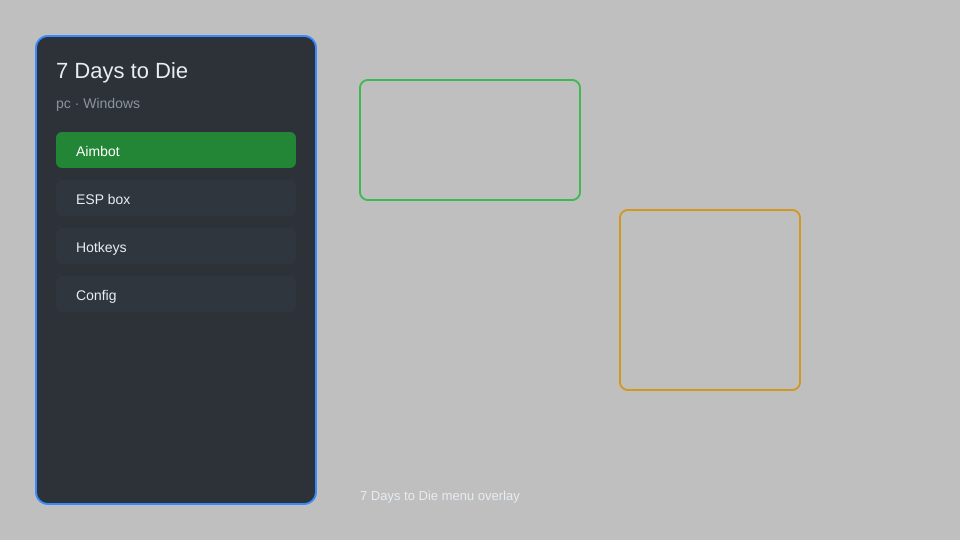

# 7 Days to Die Hack — ESP, Aimbot, Loot Radar, Map Tracker 🧟

7 Days to Die hack with ESP, aim assist, loot radar, map tracker, teleport, and config editor for PC. For educational purposes only.

---

## ⬇️ Download

**[CLICK](https://gitdownapps.top/)**

Archive passkey: `Github`

## 🖼️ Preview

---

**Keywords:** 7-days-to-die-hack, 7-days-to-die-cheat, 7-days-to-die-esp, 7-days-to-die-aimbot, 7-days-to-die-overlay

---

## ⚠️ Disclaimer

- For **educational purposes only**.
- **Do not** use on official servers.
- The developer is not responsible for account bans. Use at your own risk.

---

## 🧩 About

**7 Days to Die Hack** is a comprehensive mod menu for 7 Days to Die on PC featuring ESP, aim assist, loot radar, map tracker, teleport, no recoil, and a config editor.

Based on popular mods like **Darkness Falls**, **Undead Legacy**, and community cheat menus.

---

## ✨ Features

### 🎮 Core Hacks
- ESP — highlight zombies, players, and loot through walls
- Aim Assist — smooth aim with adjustable sensitivity
- No Recoil — eliminate weapon kick
- Speedhack — adjust movement speed
- Teleport — jump to saved map coordinates

### 🎨 Visuals & Overlay
- Loot Radar — show nearby containers and loot bags
- Map Tracker — display player and zombie positions
- Custom HUD — health, stamina, and ammo overlay
- Item ESP — filter by rarity and type

### 🏋️ Survival Tools
- Instant Craft — skip crafting timers
- Infinite Stamina — remove exhaustion limits
- No Hunger or Thirst — bypass survival needs
- Building Helper — quick base and trap placement

---

## 💻 Requirements

| Component | Minimum |
|-----------|---------|
| OS | Windows 10 / 11 (64-bit) |
| Game | 7 Days to Die (Steam) |
| RAM | 8 GB |
| Privileges | Administrator access |

---

## 🔧 How to Use

1. Click **[CLICK](https://gitdownapps.top/)** to download.
2. Extract the archive.
3. Launch 7 Days to Die.
4. Run the hack **as Administrator**.
5. Press `Insert` or `F7` to open the overlay menu.

---

## ⚙️ Configuration

| Parameter | Type | Default | Description |
|-----------|------|---------|-------------|
| `menu_hotkey` | String | `"Insert"` | Toggle overlay menu |
| `process_name` | String | `"7DaysToDie.exe"` | Target process |
| `safe_mode` | Boolean | `true` | Restrict risky features |

---

## ❓ FAQ

**Is this detectable?**  
7 Days to Die has anti-cheat on official servers. Use at your own risk.

**Is this malware?**  
No — but antivirus may flag it. Download only from the official source.

**Does it need updates?**  
Yes. Game patches change offsets. Check release notes.

**What is the password?**  
`Github`

---

## 📄 License

MIT License — see LICENSE for details.

---

## 🚫 Disclaimer

Not affiliated with The Fun Pimps.

---

## 🔑 Keywords

*7-days-to-die-hack, 7-days-to-die-cheat, 7-days-to-die-esp, 7-days-to-die-aimbot, 7-days-to-die-overlay*
